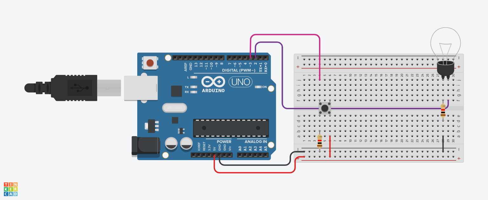

# Interruptor Toggle com Contador (Lâmpada)

Circuito que simula um interruptor real: um único botão liga e desliga a lâmpada alternadamente a cada pressão, usando lógica de contagem par/ímpar.

## Como funciona

O código mantém uma variável `cont` que é incrementada toda vez que o botão (pino 3) é pressionado. O estado da lâmpada (pino 2) é definido pelo resto da divisão desse contador por 2:

- Se `cont` for **par** → lâmpada desligada (LOW)
- Se `cont` for **ímpar** → lâmpada ligada (HIGH)

Diferente de um botão comum (que só liga enquanto pressionado), esse circuito **memoriza o estado**: aperta uma vez liga, aperta de novo desliga — como um interruptor de parede de verdade.

Um pequeno delay de 300ms é usado para evitar leituras múltiplas indesejadas causadas por ruído mecânico do botão (debounce simples).

## Componentes utilizados

- 1x Arduino Uno
- 1x Botão (push button)
- 1x Lâmpada
- 2x Resistor (1 para o botão, 1 em série com a lâmpada)
- Protoboard e jumpers

## Esquema de conexão

| Pino Arduino | Componente |
|---|---|
| 3 | Botão (entrada) |
| 2 | Lâmpada (saída) |

## Como reproduzir

1. Monte o circuito conforme o esquema acima
2. Faça upload do código via Arduino IDE (ou abra no Tinkercad/simulador)
3. Pressione o botão e observe a lâmpada alternar entre ligada e desligada a cada aperto

---

Desenvolvido por Maria Eduarda Albuquerque
